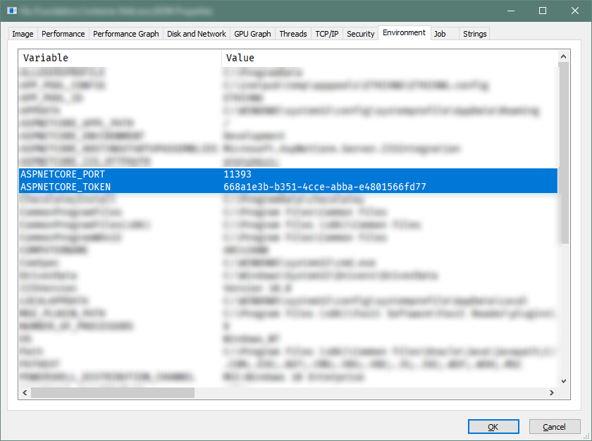
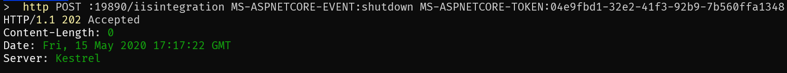

## Giriş

ASP.NET Core uygulamalarını IIS üzerinde çalıştırmak için uygulamanızın başlangıcında
`UseIISIntegration` diyerek bir middleware eklendiğini bilirsiniz.


```csharp
public static IWebHost BuildWebHost(string[] args) =>
    WebHost.CreateDefaultBuilder(args)
        .UseStartup<Startup>()
        .UseIISIntegration()
        .UseKestrel()
        .Build();

```

Metodun özet kısmındaki açıklama kısmı yeterince açıklayıcı değil.

```
// Summary:
//     Configures the port and base path the server should listen on when running behind
//     AspNetCoreModule. The app will also be configured to capture startup errors.
//
// Parameters:
//   hostBuilder:
```

Peki bu IIS Middleware ne iş yapar? ASP.NET core kodlarını inceleyerek anlamaya çalışacak, akabinde çalışan bir uygulama process'inin
HTTP isteği ile durdurarak bir uygulama yapacağız.


## Kodları İncelemeye Başlayalım

ASP.NET Core reposundayken <kbd>T</kbd> tuşuna bastığımızda Github bize fzf [^fzf] benzeri bir arayüzle dosya arama özelliği sunuyor.
Burada arayacağımız dosya `IISMiddleware.cs`

101 ve 109 arasındaki kısımlara bakıldığında gelen bir HTTP isteği

- POST isteği ise
- Request `ANCMRequestPath` değişkenine eşitse
- Headerdan gelen bir `MSAspNetCoreEvent` değişkeninin `ANCMShutdownEventHeaderValue` değerine eşitse

Process sonlandırılıyor ve `HTTP 202` döndürüldüğünü görüyoruz.

Kodları [^ancm] incelediğimizde bu değişkenlerin tanımlandığı kısımda aşağıdaki tanımları görüyoruz.

```csharp
public class IISMiddleware
{
    private const string MSAspNetCoreToken = "MS-ASPNETCORE-TOKEN";
    private const string MSAspNetCoreEvent = "MS-ASPNETCORE-EVENT";
    ...
    private const string ANCMShutdownEventHeaderValue = "shutdown";
    private static readonly PathString ANCMRequestPath = new PathString("/iisintegration");
```

Öylese biz aşağıdaki gibi bir HTTP isteği attığımızda bu process sonlanmalı.

```http
POST /iisintegration HTTP/1.1
  MS-ASPNETCORE-EVENT: shutdown
  MS-ASPNETCORE-TOKEN: ????????
```

## İki Soru

- Bu HTTP POST isteğini hangi uygulamaya yapacağız?
  *  Web uygulamamızın çalıştığı porttaki web uygulması
  *  Arka tarafta bizim görmediğimiz bir web uygulaması

- `MS-ASPNETCORE-TOKEN` token değerine nasıl ulaşacağız?

### Cevaplar Environment Variables değerlerinde gizli

- SysInternals Process Explorer [^procexp] aracı ile uygulamanızın environmental variable değişkenlerine ulaşabilirsiniz.



httpie [^httpie] ile isteğimizi atalım.

```shell
http POST \
    :19890/iisintegration \
    MS-ASPNETCORE-EVENT:shutdown \
    MS-ASPNETCORE-TOKEN:04e9fbd1-32e2-41f3-92b9-7b560ffa1348
```

Powershell ile:

```powershell
Invoke-WebRequest `
  -Uri http://localhost:19890/iisintegration `
  -Method POST `
  -Headers @{"MS-ASPNETCORE-EVENT"="shutdown"; "MS-ASPNETCORE-TOKEN"="04e9fbd1-32e2-41f3-92b9-7b560ffa1348"}
```



### Mekanizmanın Çalışması

- IIS, her bir web uygulaması için yeni bir web uygulaması ayağa kaldırıyor.
- PORT ve TOKEN değerlerini rastgele şekilde veriyor.
- Bu porttaki uygulamaya "sadece localhost" üzerinden attığız bir HTTP isteği ile process durdurma işlemini gerçekleştirebiliyorsunuz.

## Sonuç

Token ve Port değerleri Environmental Variable değişkenleri olduğu için bu değerleri sabit değerler olarak tanımlayabilirsiniz.
Böylece sabit bir `PORT` ve sabit bir `TOKEN` değeriniz olacağı için, uygulamanızı `HTTP` üzerinden sabit ve küçük bir script sonlandırabilirsiniz.

Böyle bir kullanıma ihtiyacınız yüksek ihtimalle olmayacaktır, olmamalı ve olmamasını da temenni ederim.

İyi çalışmalar.


[^procexp]: [docs.microsoft.com/en-us/sysinternals/downloads/process-explorer](https://docs.microsoft.com/en-us/sysinternals/downloads/process-explorer)
[^ancm]: [github.com/dotnet/aspnetcore/blob/b3c6c43](https://github.com/dotnet/aspnetcore/blob/b3c6c43/src/Servers/IIS/IISIntegration/src/IISMiddleware.cs#L101-L109)
[^fzf]: [github.com/junegunn/fzf](https://github.com/junegunn/fzf)
[^httpie]: [github.com/jakubroztocil/httpie](https://github.com/jakubroztocil/httpie)