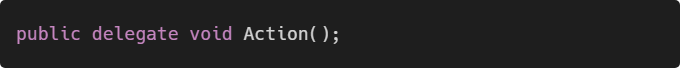
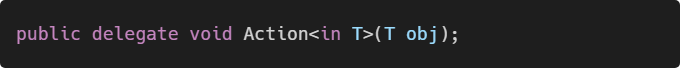
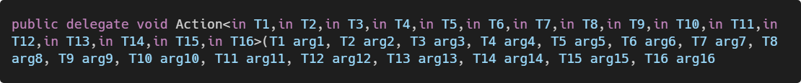
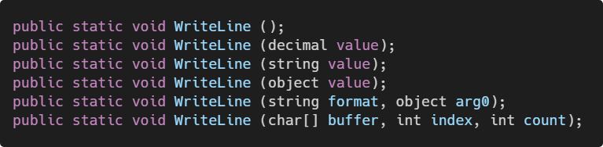
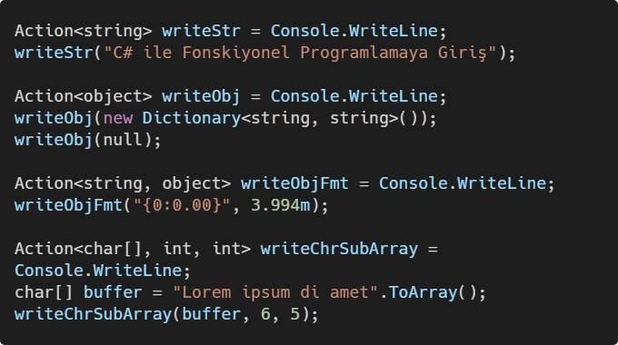
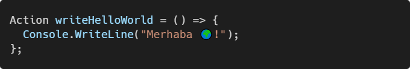
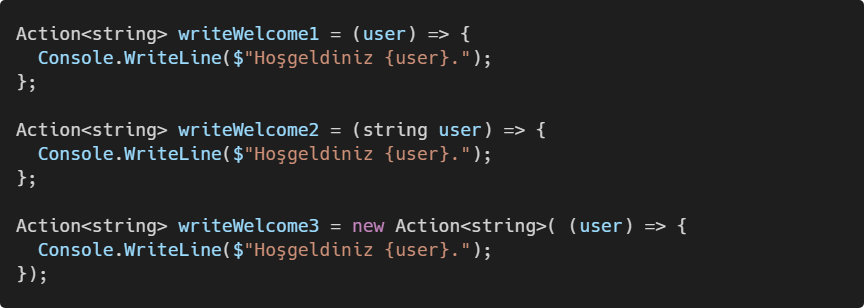
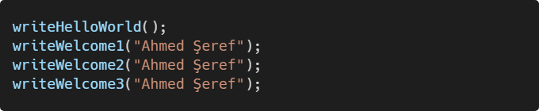
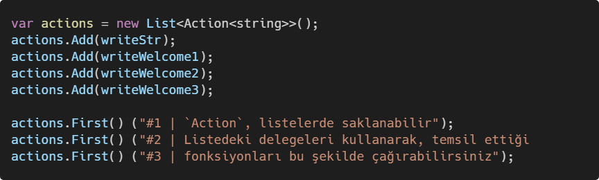
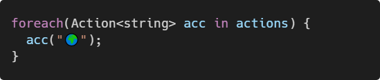

## Giriş

Önceki yazımızda [^functional-programming-with-csharp-intro-delegates], fonksiyonel programlamanın temellerinden bahsederek, `Func` ve
`Action` delege türüne değindik ve bir fonksiyondan yeni bir fonksiyonun
nasıl döndürüleceğine dair kısa bir örnek yaptık.

Bu yazımızda, `Func` ve `Action` türlerini daha yakından tanımaya çalışacağız.

## `Action` Delege Türü

`Action` delege türü, dönüş tipi olmayan (`void` olan) fonksiyonları temsil etmek
için kullanılır.

Hiçbir parametre almayan ve hiçbir dönüş tipi olmayan fonksiyonlar için `Action`
delege türü kullanılır.

<!--
```csharp
  public delegate void Action();
```
-->



Tek parametre alan fonksiyonlar içinse jenerik `Action<T>` delegesi kullanılır.

<!--
```csharp
  public delegate void Action<in T>(T obj);
```
-->



`Action` delegesinin 16 jenerik parametreye kadar parametre alan türü mevcuttur.

<!--
```csharp
  public delegate void Action<in T1,in T2,in T3,in T4,in T5,in T6,in T7,in T8,in T9,in T10,in T11,in T12,in T13,in T14,in T15,in T16>(T1 arg1, T2 arg2, T3 arg3, T4 arg4, T5 arg5, T6 arg6, T7 arg7, T8 arg8, T9 arg9, T10 arg10, T11 arg11, T12 arg12, T13 arg13, T14 arg14, T15 arg15, T16 arg16);
```
-->




### `Console.WriteLine` Fonksiyonlarını `Action` ile Temsil Etmek

`Console.WriteLine` fonksiyonunun (yanlış saymadıysam) 18 adet türevi (`overload`)
mevcut. Dönüş tipleri `void` olduğu için `Action` ile temsil edilebilir.

Bunlardan birkaçı:

<!--
```csharp
  public static void WriteLine ();
  public static void WriteLine (decimal value);
  public static void WriteLine (string value);
  public static void WriteLine (object value);
  public static void WriteLine (string format, object arg0);
  public static void WriteLine (char[] buffer, int index, int count);
```
-->




`WriteLine ()` metodu için bir delege atayalım ve fonksiyonu çağırmak için bu
delegeyi kullanalım. Hiçbir parametre almadığı için jenerik `Action` delege
türünü kullanacağız.

<!--
```csharp
  Action newLine = Console.Writeline;
  newLine();
```
-->

 Türevini Action Delege ile Temsil Ettik")

**Çıktısı konsolda boş bir satır.**

`WriteLine (decimal value)` için aynı işlemi yapalım. Bu defa, fonksiyonumuz tek
parametre alacağı için jenerik `Action<T>` delege türevini kullanmamız gerekiyor.

<!--
```csharp
  Action<decimal> writeDecimal = Console.WriteLine;
  writeDecimal(99.90m);
```
-->

 türevini, tek parametreli Action delege ile temsil ettik")

**Çıktısı:**

```txt
99.90
```

İki örnekte sağ tarafta `Console.WriteLine` vermemize rağmen derleyici,
en uygun jenerik türü belirledi ve *kapalı dönüştürme* (Implicit Conversation)
işlemi uyguladı.

Aynı işlemleri diğer türevler için de uygulayalım:

<!--
```csharp
  Action<string> writeStr = Console.WriteLine;
  writeStr("C# ile Fonskiyonel Programlamaya Giriş");

  Action<object> writeObj = Console.WriteLine;
  writeObj(new Dictionary<string, string>());
  writeObj(null);
  
  Action<string, object> writeObjFmt = Console.WriteLine;
  writeObjFmt("{0:0.00}", 3.994m);
  
  Action<char[], int, int> writeChrSubArray = Console.WriteLine;
  char[] buffer = "Lorem ipsum di amet".ToArray();
  writeChrSubArray(buffer, 6, 5);
```
-->




**Çıktısı:**

```txt
C# ile Fonskiyonel Programlamaya Giriş
(0 items)
null
3.99
ipsum
```

### Fonksiyonel Programlamadaki Yeri

Önceki yazımızda fonksiyonel programlamayı tanımlarken bahsettiğimiz:

- Fonksiyonların değişkenler gibi tanımlanabilmesi
- Fonksiyonların, diğer fonksiyonlara parametre olarak geçilebilmesi

yöntemlerini uygulayabilmek için `Action` ve türevlerine ihtiyacımız olacak.
`newLine`, `writeDecimal`, `writeObj`, `writeObjFmt`, `writeChrSubArray` artık birer
değişken oldukları için, bunları fonksiyonlarımızdan döndürebilir,
`List`, `Dictionary` gibi veri yapılarında saklayabiliriz.

## Kullanıcı Tanımlı `Action` Delegeler

Yukarıdaki örneklerde mevcut fonksiyonlara delege atadık. Bu defa ise
fonksiyonlarımızı `Action` kullanarak tanımlayacağız.

<!--
```csharp
  Action writeHelloWorld = () => {
    Console.WriteLine("Merhaba 🌍!");
  };
```
-->




Aşağıda yeni bir fonksiyon tanımlayarak bunları delegeler ile temsil edebilmek
için C#'ın bize sağladığı üç farklı yolu görüyorsunuz.

<!--
```csharp
  Action<string> writeWelcome1 = (user) => {
    Console.WriteLine($"Hoşgeldiniz {user}.");
  };
  
  Action<string> writeWelcome2 = (string user) => {
    Console.WriteLine($"Hoşgeldiniz {user}.");
  };
  
  Action<string> writeWelcome3 = new Action<string>( (user) => {
    Console.WriteLine($"Hoşgeldiniz {user}.");
  });
```
-->



`writeWelcome1`, `writeWelcome2` ve `writeWelcome3`, `string` tipinde tek
parametre alan  fonksiyonlarımız temsil ediyor.
`writeHelloWorld` ise hiçbir parametre almayan fonksiyonumuzu temsil ediyor.

Tanımladığımız fonksiyonları delegeler aracılığıyla çağıralım:

<!--
```csharp  
  writeHelloWorld();
  writeWelcome1("Ahmed Şeref");
  writeWelcome2("Ahmed Şeref");
  writeWelcome3("Ahmed Şeref");
```
-->



**Çıktısı:**

```txt
Merhaba 🌍!
Hoşgeldiniz Ahmed Şeref.
Hoşgeldiniz Ahmed Şeref.
Hoşgeldiniz Ahmed Şeref.
```

## `Action` Delegesini Listede Saklamak

Fonksiyonları listelerde saklayamıyoruz fakat delegeleri saklayabiliriz.
Delegeleri sakladığımız listeleri kullanarak temsil ettikleri fonksiyonları
çağırabiliriz.

<!--
```csharp
  var actions = new List<Action<string>>();
  actions.Add(writeStr);
  actions.Add(writeWelcome1);
  actions.Add(writeWelcome2);
  actions.Add(writeWelcome3);

  actions.First() ("#1 | `Action`, listelerde saklanabilir");
  actions.First() ("#2 | Listedeki delegeleri kullanarak, temsil ettiği");
  actions.First() ("#3 | fonksiyonları bu şekilde çağırabilirsiniz");
```
-->



**Çıktısı:**

```txt
#1 | `Action`, listelerde saklanabilir
#2 | Listedeki delegeleri kullanarak, temsil ettiği
#3 | fonksiyonları bu şekilde çağırabilirsiniz
```

Tanımladığımız `actions` listesi içindeki bütün delegeleri 🌍 parametresi
ile çağıralım.

<!--
```csharp
  foreach(Action<string> acc in actions) {
    acc("🌍");
  }
```
-->



**Çıktısı:**

```txt
🌍
Hoşgeldiniz 🌍.
Hoşgeldiniz 🌍.
Hoşgeldiniz 🌍.
```

## Sonuç

Bu yazımızda `Action` delegesini tanımaya çalıştık ve fonksiyonel programlama
ile ilişkisini örneklerle açıklamaya çalıştık.

Bir sonraki yazımızda dönüş tipi `void` olmayan fonksiyonlar için kullanmamız
gereken `Func` delegesinden bahsetmeye çalışacağız.

## Bağlantılar

1. <https://docs.microsoft.com/en-us/dotnet/api/system.action>
2. <https://docs.microsoft.com/en-us/dotnet/api/system.action-16>
3. <https://docs.microsoft.com/en-us/dotnet/api/system.console.writeline>
4. <https://docs.microsoft.com/en-us/dotnet/csharp/language-reference/language-specification/conversions#implicit-conversions>

[^functional-programming-with-csharp-intro-delegates]: [C# İle Fonksiyonel Programlamaya Giriş - Delegeler](https://blog.guneysu.xyz/post/functional-programming-with-csharp-intro-delegates/)
