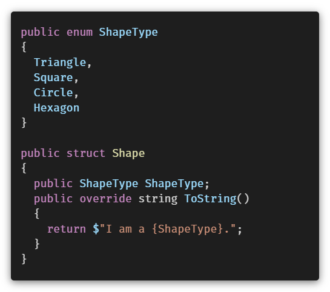
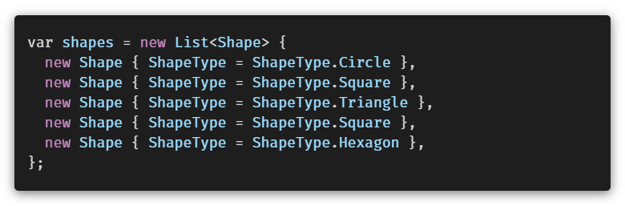
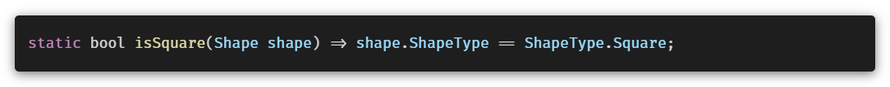
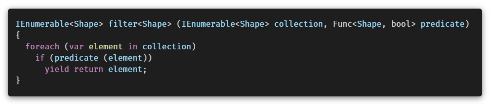
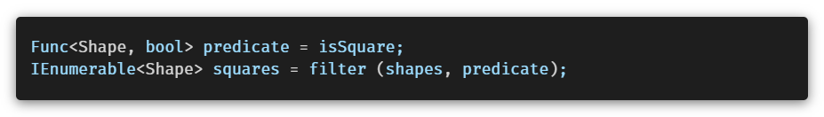
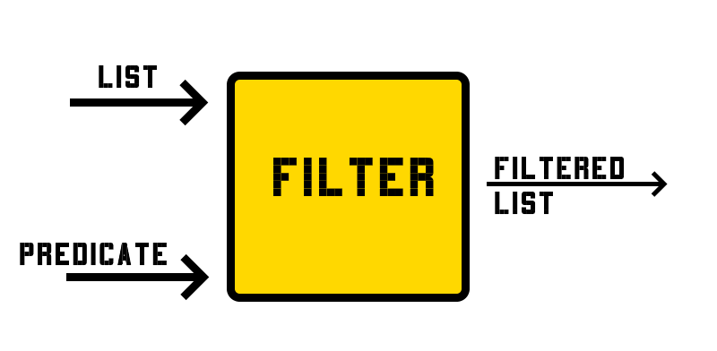

## Giriş

Önceki yazımızda fonksiyonel programlama yöntemlerinden `map` [^map] işleminden bahsettik. Bu yazımızda kısaca `filter` işleminden bahsedecek, bir sonraki yazımızda ise `reduce` üzerine eğileceğiz.

Önceki yazımızda Steven Luscher'ın tweeti tekrar eklemeyi istiyorum.

<blockquote class="twitter-tweet">
Map/filter/reduce in a tweet:  map([🌽, 🐮, 🐔], cook) =&gt; [🍿, 🍔, 🍳]  filter([🍿, 🍔, 🍳], isVegetarian) =&gt; [🍿, 🍳]  reduce([🍿, 🍳], eat) =&gt; 💩
&mdash; Steven Luscher (@steveluscher) <a href="https://twitter.com/steveluscher/status/741089564329054208?ref_src=twsrc%5Etfw">June 10, 2016</a></blockquote> 

### Filter

Filter yönteminin uygulayabilmek için, `boolean` döndüren bir metota ihtiyacınız var. 
Bu metot, bir delege veya expression olabilir. [^fn1]

C# ile `filter` için kullanılacak metodun, listenin elemanları için `true ✅` veya `false ❌` döndürmesi gerekiyor.

### Basit bir `filter` uygulaması

Amacımız, elimizdeki bir şekil listesinden kare olanları seçmek. Elimizdeki metot:

- Listemizdeki her eleman için çalışacak,
- Kare olanlar için **`true`** döndürecek,
- Böylece sadece kare şekilleri ayıklayabileceğiz.

Elimizdeki veri setini simüle eden bir liste tanımladık.

Filtre için kullanacağımız kare şekiller için `true` döndürecek olan  metodumuz.

`filter` metodumuzun ikinci parametresi bir delege, diğer ifadeyle **metotu temsil eden** bir değer. 
C# ile metotları parametre olarak geçebilmemizi sağlayan **`Func<T, bool>`** delegemize teşekkür ediyoruz.

`predicate` değerimiz ile `isSquare` metodumuzu temsil ettik ve `filter` metodumuza listemizle beraber bu delegemizi geçtik ve sadece kare şekillerimizi aldık.

<!-- ## Edit

- _2020/12/20_ - İş arkadaşım Zişan, LINQ Pad dosyası örneği yerine dotnet fiddle önerdi. Linki aşağıya bırakıyorum, kaydırarak açabilirsiniz. 
- -->

## Sonuç
Örneğini yaptığımız `filter` metodunu, LINQ ile beraber gelen `shapes.Where` ile uygulayabilirsiniz.
Amacımız `filter` çalışma yöntemini kavramak ve delegelerle basit bir uygulamasını yapmaktı.

- `.Where` extension metodu, hem `IEnumerable` hem `IQueryeble` için mevcut aralarında önemli bir fark var, yazının kapsamı dışında.
- `isSquare` metodunu  `Func<Shape>` delegesi türüyle temsil etmiştik. `Predicate<Shape>` bu delegenin eşdeğeri.
- `isSquare` metodunu, `Lambda` expression olarak da tanımlayabilirdik, bu da yazının kapsamı dışında.

Yazıyı sonuna kadar okuduğunuz için teşekkürler, her türlü geri bildirim ve eleştirilerinizi yorum olarak belirtebilirsiniz.

## Bağlantılar

1. <https://docs.microsoft.com/en-us/dotnet/api/system.linq.enumerable.where?view=net-5.0>
2. <https://docs.microsoft.com/en-us/dotnet/api/system.linq.queryable.where?view=net-5.0>
3. <https://docs.microsoft.com/en-us/dotnet/api/system.predicate-1?view=net-5.0>
4. [FILTER - dotnet fiddle](https://dotnetfiddle.net/nAuAFv)

[^fn1]: Delegelere [C# İle Fonksiyonel Programlamaya Giriş - Delegeler](/post/functional-programming-with-csharp-intro-delegates/) yazımızda giriş yapmıştık.
Expression konusu ise geniş kapsamlı bir konu, ileride geniş şekilde yer vermeyi planlıyorum.
[^map]: [C# İle Fonksiyonel Programlama - Map](/post/functional-programming-with-csharp-map/)